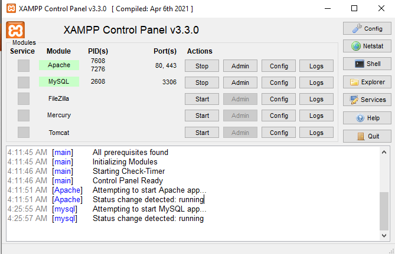
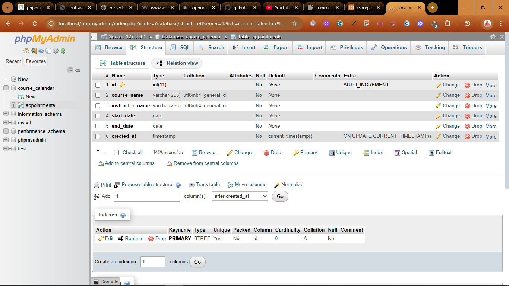

# Google Calendar Clone Tutorial 
It is developed in PHP, MySQL, JavaScript, CSS3, HTML.
- No frameworks or library used.

> `Google Calender Clone`
> - A dynamic web based scheduling application.
> - It allows users to add, delete and edit multi-day events with an intuitive interface, clean responsive mobile friendly layout. 

### Features
- Scheduling App
- Dynamic Event Handling
- Responsive Layouts
- Database Integrations
- Form Handling

### Languages and Tools
- HTML5
- CSS3
- PHP
- JavaScript
- MySQL, SQL
- Google Fonts i.e. Inter
- XAMPP (Local MySQL Server)

### Purpose of the Languages used
- `PHP` -  for backend scripting, form handling, database communications. How PHP interacts as a backend scripting language, how to handle data

- `MySQL` - persistent data storage for appointments to store events and tasks in SQL tables or database.

- `JavaScript` - Client-side calendar logic, event rendering, model controls. To show pop-ups, make the page interactive.

- `HTML5` - to design and build the structure of the user interface.

- `CSS3` - for styling and responsiveness.

### HOW TO
- Create the clock in JavaScript
- Create the Calendar in JavaScript

#### Database and table
- Start the XAMPP server(Apache and MySQL) 

- Go to localhost, select the tab of phpMyAdmin
- Create a db `course_calendar`
- create a table `appointments` in the db above with fields as `id int(11)`, `course_name varchar(255)`, `instructor_name varchar(255)`, `start_date date`, `end_date date`, `created_at timestamp`.

